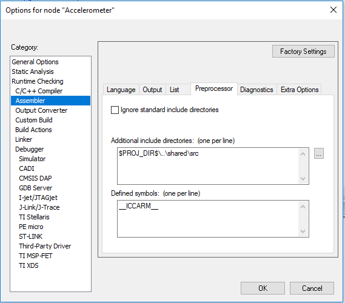
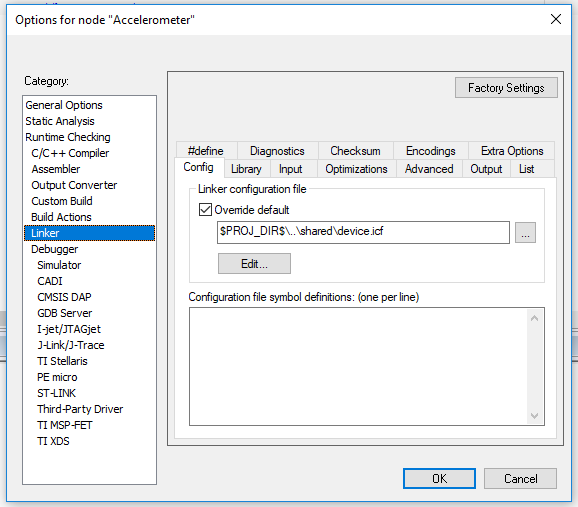

# IAR Tutorial Ammendum

> The latest version of this document can be found on github: https://github.com/nlowe/iar-startup-i2c-tutorial

This repository contains code samples for getting proper data segment initialization and an
i2c driver for I2C1. All code is licensed under the MIT license. I will do my best to explain
each important section, but full source can be found in the `shared/` folder.

> **A note on adding this to your project**:
>
> I recommend adding the `shared/` folder to the root of your workspace and creating a folder
> for each individual project. You can see an example of this in [nlowe/EECS3100](https;//github.com/nlowe/EECS3100).
> To add this code to your project, do the following:
>
> 1. Right click on your project and click "Add Files"
>     * Navigate to the `shared/` folder and add the following files to your workspace:
>       * `src/i2c.S`
>       * `src/i2c.h`
>       * `src/i2c_private.h`
>       * `src/iar_boot.S`
>     * If you need to modify the linker layout, you might want to add `shared/device.icf` but this is **not** required
> 2. Right click on your project and go to `Options`.
>     * Under `Runtime Checking` > `Assembler` > `Linker`:
>       * Add `shared/src` as an include directory. If you followed the recommended layout above, you can use `$PROJ_DIR$\..\shared\src` and the assembler will locate this directive relative to any project regardless of where it is on your system
>       * Add `__ICCARM__` as a Defined symbol
>       * If you did it right, it should look something like this 
>     * Under `Runtime Checking` > `Linker` > `Config`:
>       * Tick `Override default` under `Linker configuration file` and set the value to the path of `shared/device.icf`. If you followed the recommended layout above, you can use `$PROJ_DIR$\..\shared\device.icf` and the linker will locate this relative to any project regardless of where it is on your system.
>       * If you did it right, it should look something like this 

## Initializing Data Segments

I was unable to get deta segment initialization working in the IAR assembler. Older versions such as that on the lab
computers would throw a warning at runtime, and newer versions would not even assemble my code. To resolve this, I
wrote my own startup code to initialize these segments and modified the linker script to tell the linker that I was
responsible for initializing `.data` segments. You will need this code if you want a stack as the default startup
code generated by IAR Embedded Workbench does not properly initialize the stack register upon reset.

### The linker Script (`shared/device.icf`)

The first major change is telling the linker that we will be manually initializing `.data` segments:

```
initialize manually { section .data };
```

This tells the linker to place the contents of `.data` sections from our assembled object files and place them in
ROM in a segment called `.<segment_name>_init` and relocate all references to these values to a segment placed in
RAM. We do this by adding the following line:

```
place in ROM_region { readonly, section .data_init };
place in RAM_region { readwrite, section .data };
```

Finally, we export a symbol pointing to the top of stack:

```
define symbol __stack = __RAM_start__ + 128k;
export symbol __stack;
```

Note that this declares a 128k stack **minus** whatever you have in your data segments. An improvement would be to
set the `__stack` symbol to the end of ram with proper alignment for the stack taken into account.

### The startup code (`shared/src/iar_boot.S`)

Now that we have our segments defined and our stack symbol exported, we can begin writing our startup code:

```arm
NAME boot

PUBLIC  __iar_program_start
PUBLIC  __vector_table
PUBLIC  _halt
EXTERN  main
EXTERN  __stack
EXTERN  __i2c1_ev
EXTERN  __i2c1_er

;; SFE and SFB need segment definitions in the same object
;; Declare data and init table here as well
RSEG .data : DATA(2)
RSEG .data_init : CONST(2)
```

We start off by declaring a module called `boot` and export a few symbols for use by other objects (`PUBLIC ...`).
We also import several symbols from other object files for use later on (`EXTERN ...`). In order to get the location
and length of the `.data` and `.data_init` segments, we must declare them as relocatable segments in the same object
we intend to perform these calculations on.

Now, we can start to write our initialization code

```arm
SECTION .text:CODE:REORDER(1)

;; Keep vector table even if it's not referenced
REQUIRE __vector_table

THUMB
```

This simply declares that we want to place the `THUMB` instructions in the following line in the `.text` segment. We
also tell the linker to keep the `__vector_table` segment even though no other object references it. We are finally
ready to initialize the data segment:

```arm
;; Initialize data segment 4 words at a time
__iar_program_start:
        ldr     r0,  =SFB(.data_init)
        ldr     r1,  =SFB(.data)
        eor     r6, r6, r6
        ldr     r7, =SIZEOF(.data_init)
__init_data:
        sub     r8, r7, r6
        cmp     r8, #16
        blt     __init_data_small ;; less than 4 words left?
        ldmia   r0!, {r2-r5}
        stmia   r1!, {r2-r5}
        add     r6, r6, #16
        cmp     r6, r7
        blt     __init_data
        
__init_data_small: ;; copy the remaining bytes one byte at a time
        cmp     r6, r7
        beq     __init_done
        ldrb    r2, [r0], #1
        strb    r2, [r1], #1
        add     r6, r6, #1
        b       __init_data_small
```

First, we load the location of the start of `.data_init` into `r0` and `.data` into `r1`. The length of these
segments should be the same and is loaded into `r7`. `r6` is used as a counter so we clear it before doing anything.
If we have at least 16 bytes of data to copy, we can use the `__init_data` loop to copy these bytes effeciently.

#### `ldmia` and `stmia`

ARM includes instructions for loading and storing multiple bytes of data, `ldmia` and `stmia`. These instructions
stand for "load / store multiple, increment after" and work by using a register as an index and a set of registers to
read or write data. After the I/O operation is performed, the base register is incremented by the number of bytes
read, meaning there is no need to maintain a separate offset variable. In our code above, we load four words of data
from the base address pointing into `.data_init` and store those values at the base address pointing into `.data`.

#### Non-aligned / small data

If there isn't enough data to use `ldmia`/`stmia` or we don't have an even multiple of four words left to copy, we
simply copy the data one byte at a time. Again, we can increment the pointer in `r0`/`r1` using a special syntax of
the `ldr` and `str` instruction.

#### Using Data Segments

Now, you can add data segments anywhere in your code **as long as these segments are named `.data`**:

```arm
    SECTION .data : DATA(2)
    ;; Declare your variables here
```

If you have data you only read from, use a `CONST` section instead (these segments can have any valid name):

```arm
    SECTION .my_vars : CONST(2)
Life:
    DC8 42
```

## Jumping to the application

Now, we clear the registers we used during initialization and nump to the `main` label:

```arm
__init_done:
        ;; Zero registers
        eor     r1, r1, r1
        eor     r2, r2, r2
        eor     r3, r3, r3
        eor     r4, r4, r4
        eor     r5, r5, r5
        eor     r6, r6, r6
        eor     r7, r7, r7
        eor     r8, r8, r8
        
        ;; Go do the thing
        B       main
        
_halt:  B      _halt
```

We do not expect to return from the `main` label, but if applications are expected to end instead of running forever
we provide a `_halt` label to jump to which simply loops forever.

### Application Code Boilerplate

The boilerplate for your application code now looks like this:

```arm
    NAME    main
    PUBLIC  main
    EXTERN  _halt

    SECTION .text : CODE (2)
    THUMB

main:
    ;; Your application code here

    ;; If you need to exit, do this:
    b       _halt

    END
```

## Handling Interrupts

We need to tell the CPU where our code starts, where the stack starts, and where our interrupt handlers are. We do
this by defining our interrupt vector table:

```arm
SECTION .intvec:CODE:NOROOT(2)
        
        DATA

__vector_table
        DCD     __stack
        DCD     __iar_program_start

        DCD     NMI_Handler
        DCD     HardFault_Handler
        DCD     MemManage_Handler
        DCD     BusFault_Handler
        DCD     UsageFault_Handler
        DCD     0
        DCD     0
        DCD     0
        DCD     0
        DCD     SVC_Handler
        DCD     DebugMon_Handler
        DCD     0
        DCD     PendSV_Handler
        DCD     SysTick_Handler
        
        REPT    31
        DCD     NOP_Handler ;; I don't want any other interrupts please
        ENDR
        
        DCD     I2C1_EV_IRQHandler
        DCD     I2C1_ER_IRQHandler
        
        REPT    48
        DCD     NOP_Handler
        ENDR
```

See the reference manual for what each vector does but we can see here that the first vector is the location of the
initial stack, which we exported in our linker script. The second vector points to our startup code.

Further on, we skip a few using a repeat macro. I did this because I was only interested in the vectors for `I2C1`
and didn't want to pollute my code.

Finally, we implement our interrupt handlers:

```arm
SECTION .text:CODE:REORDER:NOROOT(1)
        THUMB
        
NOP_Handler
        mov     pc, lr
        
I2C1_EV_IRQHandler
        push    {lr}
        bl      __i2c1_ev
        pop     {pc}

I2C1_ER_IRQHandler
        push    {lr}
        bl      __i2c1_er
        pop     {pc}

NMI_Handler
HardFault_Handler
MemManage_Handler
BusFault_Handler
UsageFault_Handler
SVC_Handler
DebugMon_Handler
PendSV_Handler
SysTick_Handler
Default_Handler
__default_handler
        CALL_GRAPH_ROOT __default_handler, "interrupt"
        NOCALL __default_handler
        B __default_handler
```

The `NOP_Handler` simply returns immediately without doing anything. Our handlers for `I2C1` call handler functions
exported by the i2c driver. The Default interrupt handler will simply loop forever.

## i2c

The i2c driver is implemented in `shared/src/i2c.S`. End users should only invoke `I2C_Init`, `I2C_Write`, and
`I2C_Read`. The driver assumes you want to use `I2C1` and relies on interrupts enabled in the startup code to
function. `I2C_Init` will take care of initializing GPIO Pins, enabling peripheral clocks, and setting up interrupts
to enable `I2C1` as a master in `100 kHz` mode. Reading and writing multiple bytes is supported.

### Writing to a Slave

To write to a slave, allocate a buffer containing the data you wish to write and pass the slave address, location of
the data, and length of the data to `I2C_Write`. For example, assuming you have a slave at `0xAC`

```arm
    SECTION .data : DATA(2)
MyBuff:
    DC8 'H', 'e', 'l', 'l', 'o', ',', ' ', 'W', 'o', 'r', 'l', 'd'

    ;; ...

    SECTION .code : CODE(2)
    THUMB

    mov     r0, #0xAC       ;; Slave Address. I2C_Write will ensure the MSB is not set
    ldr     r1, =MyBuff     ;; Pointer to data buffer
    mov     r2, #12         ;; Length of data buffer
    bl      I2C_Write
```

### Reading from a Slave

To read data from a slave, allocate a buffer to hold the data you wish to read and pass the slave address, location
of the buffer, and length of the data you wish to read to `I2C_Read`. For example, assuming you have a slave
at `0xAC`:

```arm
    SECTION .data : DATA(2)
MyBuff:
    DS8     16

    ;; ...

    SECTION .code : CODE(2)
    THUMB

    mov     r0, #0xAC       ;; Slave Address. I2C_Write will ensure the MSB is set
    ldr     r1, =MyBuff     ;; Pointer to data buffer
    mov     r2, #16         ;; Number of bytes to read
    bl      I2C_Read

    ;; Data now at MyBuff
```

## License

The i2c driver was reverse engineered from sample code provided by STmicroelectronics. All other code is licensed
under the MIT License.

### The MIT License (MIT)

Copyright © 2017 Nathan Lowe

Permission is hereby granted, free of charge, to any person
obtaining a copy of this software and associated documentation
files (the “Software”), to deal in the Software without
restriction, including without limitation the rights to use,
copy, modify, merge, publish, distribute, sublicense, and/or sell
copies of the Software, and to permit persons to whom the
Software is furnished to do so, subject to the following
conditions:

The above copyright notice and this permission notice shall be
included in all copies or substantial portions of the Software.

THE SOFTWARE IS PROVIDED “AS IS”, WITHOUT WARRANTY OF ANY KIND,
EXPRESS OR IMPLIED, INCLUDING BUT NOT LIMITED TO THE WARRANTIES
OF MERCHANTABILITY, FITNESS FOR A PARTICULAR PURPOSE AND
NONINFRINGEMENT. IN NO EVENT SHALL THE AUTHORS OR COPYRIGHT
HOLDERS BE LIABLE FOR ANY CLAIM, DAMAGES OR OTHER LIABILITY,
WHETHER IN AN ACTION OF CONTRACT, TORT OR OTHERWISE, ARISING
FROM, OUT OF OR IN CONNECTION WITH THE SOFTWARE OR THE USE OR
OTHER DEALINGS IN THE SOFTWARE.
